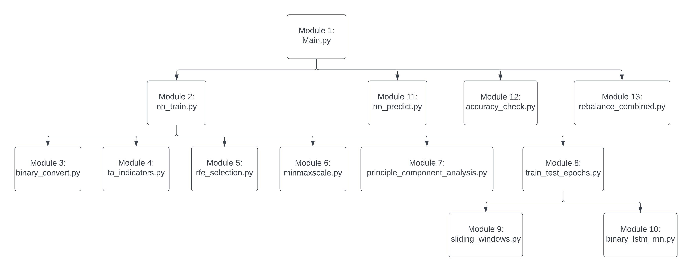
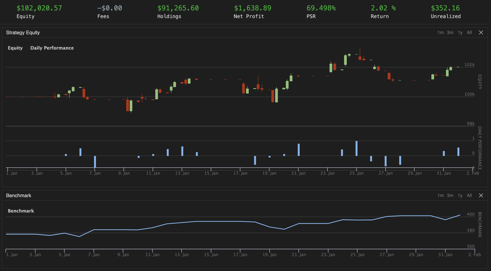
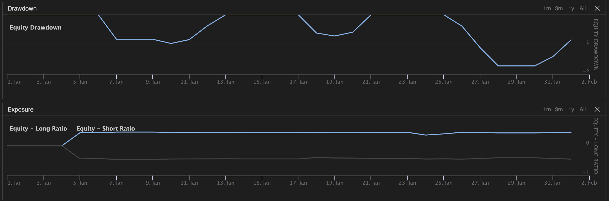
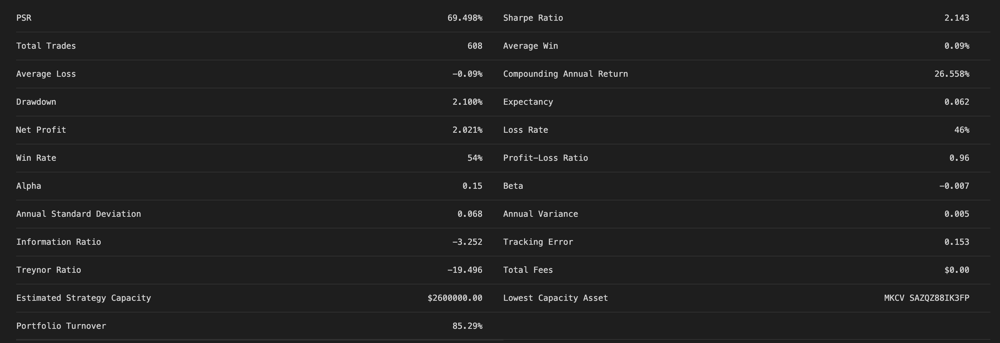

# **Long Short-Term Memory Neural Network Daily Trading Strategy**

## **Introduction:**

This algorithmic trading strategy uses time-series data and advanced machine learning techniques, employing a PyTorch-based long short-term memory (LSTM) neural network. Designed for implementation on [QuantConnect's online backtesting platform](https://www.quantconnect.com/), the strategy incorporates predictive modeling, dynamic stock selection, a rebalancing mechanism, and automated trading decisions.

**Strategy Overview:**

The architecture of the strategy is built by 13 modules, initiating with data preprocessing and feature engineering. This initial phase lays the groundwork for subsequent modeling.

The algorithm places an emphasis on temporal dependencies in stock price movements, which is performed by a Long Short-Term Memory (LSTM) neural network. The LSTM architecture excels in handling sequential data, making it well-suited for instances where past information holds insights for predicting future trends, like the stock market. This neural network architecture, with its ability to retain and utilize historical context , contributes to the model's understanding of market dynamics and enhances its predictive capabilities.

The incorporation of 91 widely recognized technical indicators during feature engineering ensures that the model is equipped with a data set of indicators commonly used by other traders and algorithms. The strategy then employs Recursive Feature Elimination (RFE) to discern the most impactful variables, streamlining the data set for model training.

To further refine the data set and mitigate the curse of dimensionality, Principal Component Analysis (PCA) is applied. The curse of dimensionality refers to the challenges and limitations that arise when dealing with data sets with a high number of features, where the volume of variables can lead to computational inefficiencies and reduced model performance. This dimensionality reduction technique helps distill the essence of the data, capturing the most significant variations while discarding redundant information.

This process of feature engineering, RFE, and PCA ensures that the algorithm is trained on a highly informative data set, providing an effective learning process for the subsequent LSTM neural network. This preparation, coupled with advanced stock selection methods and systematic rebalancing, positions the algorithm to operate autonomously with agility in dynamic market conditions.

**Modular Architecture: (Click on any image to see it full screen)**



**Benefits of this Code Include:**

-   Predictive Modeling: The use of an advanced LSTM neural network enables price predictions through capturing temporal dependence in stock movements.

-   Dynamic Stock Selection: A selection process filters stocks based on fundamental and market cap criteria, ensuring a dynamic and relevant stock portfolio.

-   Automated Trading: From data gathering to trading decisions, the entire process is automated, with functions scheduled to run at specific times during each trading day.

-   Modular Design: The strategy is thoughtfully organized into modular functions and classes, enhancing readability, organization, and ease of maintenance.

-   Parameter Flexibility: Offering parameter customization, users can adjust the number of stocks, weights, and hyper-parameters to tailor the strategy to their specific goals.

## Click [here](https://github.com/camwolford/camwolford.github.io/blob/main/README.md#results) to skip the in-depth explanation of the modules and code used in this algorithm and jump to the results of the trading algorithm.

### Module 1:

This is the main module of the strategy. It controls various aspects of the strategy that can be edited to optimize performance and risk. The algorithm executes as follows: At the start of each week the LSTM model is trained on time-series data of daily values from various technical indicators of the selected universe of stocks (weekly training is used in this implementation due to computational constraints). The data the model is trained on first is reduced to only include a certain number of these technical indicators through Recursive Feature Elimination (RFE) before the dimentionality of the data is reduced through Principle Component Analysis (PCA). Then the model predicts the next day's return in terms of binary classification (1 for a positive return and 0 for a negative return). The algorithm then selects a specific number of the predicted stocks with the most likely positive/negative returns to go long/short with. The model is saved for predicting throughout the rest of the week before being retrained at the start of the next week.

Note: In the following implementation of the algorithm, the final number of features for RFE to select was the same as the initial number of technical indicators for each stock (91), meaning that no RFE was done.

Various parts of the algorithm can be eddied in this module:

-   The number of stocks in the universe

-   The number of stocks to go long/short with

-   The weight to apply to the long/short stocks

-   The frequency of LSTM model training and prediction

-   Various hyper-parameters associated with RFE, PCA and LSTM model training and predicting

The module is set up as follows:

Initialization: Sets parameters such as the number of stocks to consider, weights for long and short positions, and hyper-parameters for the LSTM model. Initializes flags, variables, and classes needed for rebalancing, accuracy tracking, and neural network operations.

Initialization Function (Initialize):

-   Sets the algorithm's start and end dates, initial cash, and benchmark.

-   Adds the SPY ETF as a benchmark and configure the brokerage model.

-   Sets the data resolution and add the universe of stocks for consideration.

-   Schedules various functions to run at specific times during each trading day.

Coarse Selection Function (CoarseSelectionFunction):

-   Filters stocks based on fundamental data and price criteria.

-   Returns a list of top stocks based on dollar volume.

Fine Selection Function (FineSelectionFunction):

-   Filters stocks based on specific fundamental ratios.

-   Returns a list of stocks to be considered for trading.

Neural Network Training (NetTrain):

-   Invokes the neural network training class to train an LSTM model.

-   Returns relevant information such as selected stocks, feature masks, trained model, PCA eigenvectors, and explained variance ratios.

Neural Network Prediction (NetRun):

-   Invokes the neural network prediction class to generate long and short signals.

-   Returns lists of stocks for long and short positions.

Prediction Check Function (Prediction_Check):

-   Calculates and tracks the mean accuracy of the neural network predictions.

Liquidation Function (liquidate):

-   Sells holdings that are no longer part of the current long and short lists.

Rebalance Function (rebalance):

-   Executes the rebalancing function to adjust portfolio positions based on the long and short signals generated by the neural network.

``` python
# Libaries to Import
from datetime import timedelta
import numpy as np
from datetime import datetime
# Classes from other files
from AlgorithmImports import *
from rebanance_combined import rebalance_func
from accuracy_check import accuracy_class
from nn_train import nn_training_class
from nn_predict import nn_predict

class PytorchNeuralNetworkAlgorithm(QCAlgorithm):

    def __init__(self):
    # set the flag for rebalance
        self.reb = 1
    # Number of stocks to pass CoarseSelection process
        self.num_coarse = 3000
    # Number of stocks to pass marketcap selection
        self.num_marketcap = 500
    # Number of stocks to go long with
        self.num_long = 10
    # Number of stocks to go short with
        self.num_short = 10
    # Weight for long stocks
        self.weight_long = 0.5*0.9
    # Weight for short stocks
        self.weight_short = -0.5*0.9
    # List for stocks to go long and short
        self.long = None
        self.short = None
    # Hyperparameters
        self.batch_size = int(0.8*self.num_marketcap) # has to be bigger than 0.2*self                                                                 .num_marketcap
        self.num_epochs = 500 # number of epochs for the LSTM neural network to run
        self.num_feat = 91 # number of initial features of each stock
        self.num_hidden = 20 # number of hidden nodes in the LSTM neural network
        self.num_layers = 2 # number of hidden lays in the LSTM neural network
        self.learning_rate = 0.01 # learning rate for the LSTM neural network
        self.weight_decay = 0.001 # weight decay for the LSTM neural network
        self.dropout_prob = 0.2 # dropout probability for the LSTM neural network
        self.early_stopping_patience = 10 # number of epochs to wait before stopping if                                                    validation loss doesn't improve
    # Sliding Window Hyperparameters
        self.test_lookback = 5 # window and prediction time step size
        self.time_addition = 0 # add 1 to get the number of windows
        self.shift_length = 5 # number of time steps to shift for each window
    # RFE Hyperparameters
        self.feat_select = 91 # this means no rfe was done
        self.step_size = 1
    # PCA Hyperparameters
        self.components_to_select = 5 # must be at least = to self.testlookback
    # Prediction Thresholds
        self.long_threshold = 0.0 # threshold for predictions to be greater than from stocks to                                     go long with
        self.short_threshold = 1.0 # threshold for predictions to be less than from stocks to                                       go short with

    def Initialize(self):
        self.SetStartDate(2023, 1, 1)  # Set Start Date
        self.SetEndDate(2023, 1, 31) # Set End Date
        self.SetCash(100000)  # Set Strategy Cash

        # add SPY Symbol
        self.spy = self.AddEquity("SPY", Resolution.Hour).Symbol
        self.symbols = [] # using a list can extend to condition for multiple symbols
        self.symbols_used = None
        self.mean_accuracy = [] # make an inizial accuaracy list for the mean of daily                                           accuracies

        # Setting the benchmark to the spy etf
        self.SetBenchmark(self.spy)
        self.SetBrokerageModel(BrokerageName.TDAmeritrade, AccountType.Margin)
        self.UniverseSettings.Resolution = Resolution.Hour
        self.AddUniverse(self.CoarseSelectionFunction,self.FineSelectionFunction)

        # custom class initialization
        self.rebalance_func = rebalance_func(self)
        self.accuracy = accuracy_class(self)
        self.nn_training = nn_training_class(self)
        self.nn_predict = nn_predict(self)
        
    # Schedule the training function to execute at the begining of each week before everything       else
        self.Train(self.DateRules.WeekStart(self.spy), 
        self.TimeRules.AfterMarketOpen(self.spy,1), Action(self.NetTrain)) 

    # Schedule the prediction checker function to execute at the end of each day before self         .long and self.short are over-written
        self.Schedule.On(self.DateRules.EveryDay(self.spy), 
        self.TimeRules.BeforeMarketClose(self.spy,2), Action(self.Prediction_Check)) 

    # Schedule the predicting function to execute at the begining of each day after the model        training 
        self.Schedule.On(self.DateRules.EveryDay(self.spy), 
        self.TimeRules.AfterMarketOpen(self.spy,5), Action(self.NetRun)) 

    # Schedule the liquidate function to execute at the end of each day before rebalance
        self.Schedule.On(self.DateRules.EveryDay(self.spy), 
        self.TimeRules.BeforeMarketClose(self.spy,6), Action(self.liquidate)) 

    # Schedule the rebalance function to execute at the begining of each day
        self.Schedule.On(self.DateRules.EveryDay(self.spy), 
        self.TimeRules.AfterMarketOpen(self.spy, 10), Action(self.rebalance))   

    def CoarseSelectionFunction(self, coarse):
        if self.IsWarmingUp is False:
            # if the rebalance flag is not 1, return null list to save time.
            if self.reb != 1:
                pass
            
    # drop stocks which have no fundamental data or have too low prices
        selected = sorted([x for x in coarse if (x.HasFundamentalData) 
                    and (float(x.Price) > 5)], key=lambda x: x.DollarVolume, reverse=True)
        top = selected[:self.num_coarse]

        return [i.Symbol for i in top]

    def FineSelectionFunction(self, fine):
    # return null list if it's not time to rebalance
        if self.reb != 1:
            pass
        self.reb = 0

    # drop stocks which don't have the information we need.
    # you can try replacing those factor with your own factors here
        filtered_fine = sorted([x for x in fine if x.ValuationRatios.PERatio and x.EarningRatios.DilutedEPSGrowth and x.OperationRatios.EBITDAMargin], key = lambda k: k.MarketCap, reverse=True)
        filtered_fine_marketcap = filtered_fine[:self.num_marketcap]
        self.symbols = [x.Symbol for x in filtered_fine_marketcap]

        return self.symbols
        
    def NetTrain(self):
        symbols_and_mask_model_eigenvectors_explainedvaraiance = self.nn_training      .Neural_Net_Train(self.symbols, self.test_lookback, 
            self.spy, self.num_epochs, self.num_feat, self.num_hidden, self.num_layers, self.learning_rate, self.weight_decay, 
            self.dropout_prob, self.early_stopping_patience, self.feat_select, self.components_to_select, self.step_size, 
            self.batch_size, self.time_addition, self.shift_length)
        self.symbols_used = symbols_and_mask_model_eigenvectors_explainedvaraiance[0]
        self.selected_features_mask = symbols_and_mask_model_eigenvectors_explainedvaraiance[1]
        self.model = symbols_and_mask_model_eigenvectors_explainedvaraiance[2]
        self.eigenvectors_pca = symbols_and_mask_model_eigenvectors_explainedvaraiance[3]
        self.explained_variance_ratio = symbols_and_mask_model_eigenvectors_explainedvaraiance[4]

    def NetRun(self):
        long_short_list = self.nn_predict.NetPredict(self.symbols_used, self.test_lookback, self.spy,
            self.selected_features_mask, self.model, self.eigenvectors_pca, self.explained_variance_ratio, self.num_long, self.num_short, self.time_addition, self.long_threshold, self.short_threshold)
        self.long = long_short_list[0]
        self.short = long_short_list[1]

        return self.long + self.short

    def Prediction_Check(self):
        try:
            self.mean_accuracy = self.accuracy.accuracy_method(self.long, self.short, self.mean_accuracy)
        except:
            pass

    def liquidate(self): 
        holdings = [x for x in self.long] + [x for x in self.short]
        for i in self.Portfolio.Values:
            if (i.Invested) and (i.Symbol not in holdings):
                self.Liquidate(i.Symbol)             
        
    def rebalance(self):
        # run the rebalance function
        self.rebalance_func.rebalance_exc(self.long, self.short, self.weight_long, self.weight_short)

        self.reb = 1
```

### Module 2: Neural Network Training Class

This module encapsulates the training process of the neural network, incorporating RFE, PCA, and the multi-layered LSTM model. The objective is to enhance the prediction accuracy of the model for subsequent trading decisions. Several imported classes, functions, and libraries contribute to the diverse functions of this module.

Libraries:

-   torch: PyTorch, a powerful machine learning library.

-   datetime.timedelta: Represents the duration between two dates and times.

-   numpy: Numerical computing library for array operations.

-   sklearn.metrics.confusion_matrix: Computes the confusion matrix to assess classification accuracy.

-   sklearn.preprocessing.normalize: Used for normalizing the confusion matrix.

-   datetime.datetime: Provides classes for working with dates and times.

-   scipy.stats: Implements a variety of statistical functions.

Classes from Other Files:

-   Min_Max: Class for min-max scaling of time series data.

-   Binary_Convert: Class for converting continuous values to binary (1 or 0).

-   Recursive_Feature_Selection: Class for recursive feature elimination.

-   Model_Train_Test: Class for training and testing the LSTM model.

-   PCA: Class for principal component analysis. - IndicatorCalculator: Class for computing technical indicators.

Initialization:

-   Receives the algorithm instance as input to interact with the broader algorithm context.

Neural Network Training Method (Neural_Net_Train):

-   Accepts numerous parameters controlling the neural network and data processing.

-   Initializes various internal variables and structures.

-   Iterates through selected symbols, fetching historical data for returns and technical indicators.

-   Converts returns to binary values using Binary_Convert.

-   Applies Recursive Feature Selection (RFE) to determine relevant features for each stock.

-   Logs the selected features and RFE validation accuracy.

-   Prepares training data by min-max scaling and processing indicators.

-   Conducts PCA on the training data if applicable, logging explained variances.

-   Converts data to tensors and trains the LSTM model using Model_Train_Test.

-   Logs training and testing loss values and the best validation loss.

-   Converts continuous predictions to binary for confusion matrix computation.

-   Computes and logs confusion matrices and accuracy scores for both training and testing sets.

-   Returns relevant information for later use: selected symbols, feature masks, trained model, PCA eigenvectors, and explained variance ratios.

Note: The module handles exceptions, removing symbols with incomplete data from further consideration.

This module plays a crucial role in enhancing the predictive power of the algorithm, blending advanced techniques to process and train on historical data for improved decision-making in subsequent modules.

``` python
#region imports
from AlgorithmImports import *
# Libaries to Import
import torch
from datetime import timedelta
import numpy as np
from sklearn.metrics import confusion_matrix
from datetime import datetime
from sklearn.preprocessing import normalize
from sklearn.metrics import accuracy_score
from scipy import stats
# Classes from other files
from AlgorithmImports import *
from minmaxscale import Min_Max
from binary_convert import Binary_Convert
from rfe_selection import Recursive_Feature_Selection
from train_test_epochs import Model_Train_Test
from principle_component_analysis import PCA
from ta_indicators import IndicatorCalculator
#endregion

class nn_training_class:
    def __init__(self, algorithm):
        self.algo = algorithm

    def Neural_Net_Train(self, symbols, test_lookback, spy, num_epochs, num_feat, num_hidden, num_layers, learning_rate,
        weight_decay, dropout_prob, early_stopping_patience, feat_select, components_to_select, step_size, 
        batch_size, time_addition, shift_length):
        self.symbols = symbols
        self.test_lookback = test_lookback
        self.spy = spy
        self.num_epochs = num_epochs
        self.num_feat = num_feat 
        self.num_hidden = num_hidden 
        self.num_layers = num_layers
        self.learning_rate = learning_rate
        self.weight_decay = weight_decay
        self.dropout_prob = dropout_prob
        self.early_stopping_patience = early_stopping_patience
        self.feat_select = feat_select
        self.components_to_select = components_to_select
        self.step_size = step_size
        self.batch_size = batch_size
        self.time_addition = time_addition
        self.shift_length = shift_length

        self.model = []
        self.selected_features_mask = []
        self.epochs = {}

        indicator_df = {}
        
        self.stock_returns = {}

        bad_symbols = []

        for symbol in self.symbols:
            try:
                self.stock_returns[symbol] = []

                # Retrieve daily history for returns
                history_for_returns = self.algo.History(symbol, (self.test_lookback+self.time_addition+2), Resolution.Daily)
                if not history_for_returns.empty:
                    close_hist = history_for_returns.loc[str(symbol)]['close']
                    # Calculate daily returns
                    for l in range(self.test_lookback+self.time_addition+1):
                        daily_return = (close_hist[(l+1)] - close_hist[l]) / close_hist[l]
                        self.stock_returns[symbol].append(daily_return)

                # Retrieve daily history for indicators
                history_for_indicators = self.algo.History(symbol, (self.test_lookback+self.time_addition+1)+50, Resolution.Daily)
                if not history_for_indicators.empty:
                    # TA indicators DataFrame for monthly data
                    ta_indicators_df = IndicatorCalculator(self.test_lookback).compute_indicators(symbol, history_for_indicators)
                    ta_indicators_df = ta_indicators_df.dropna(axis=1)

                # convert the returns to binary
                self.stock_returns[symbol] = Binary_Convert().convert(self.stock_returns[symbol], 0)

                indicator_df[symbol] = ta_indicators_df[-3-(self.test_lookback+self.time_addition):-3] # omit the most recent value and select the self.test_lookback most recent                       values
            except:
                bad_symbols.append(symbol)
                pass

        for symbol in bad_symbols:
            self.symbols.remove(symbol)

        # Feature Selection
        # this is done using the data from 2 days ago as per the 'Short-term stock market price           trend prediction using a comprehensive machine learning system' paper
        x_rfe_train = np.concatenate([indicator_df[symbol].values[-2:-1] for symbol in self.symbols], axis=0)
        y_rfe_train = np.concatenate([np.array(self.stock_returns[symbol][-1:]) for symbol in self.symbols], axis=0)

        # RFE Version
        mask_accuracy = Recursive_Feature_Selection().select_features(x_rfe_train, y_rfe_train, self.feat_select, self.step_size)

        # Log the selected features mask
        self.selected_features_mask = mask_accuracy[0]
        self.algo.Log(self.selected_features_mask)
        # Log the RFE Validation Accuracy
        rfe_accuracy = mask_accuracy[1]
        self.algo.Log(f"RFE Validation Accuracy: {rfe_accuracy}")

        # Define the complete dataframes
        all_x_train = []
        all_y_train = []

        min_max_scaler = Min_Max()

        for symbol in self.symbols:
            # Select the self.test_lookback rows of each column in indicator_df
            x_train = indicator_df[symbol].values

            # Subset the input feature tensor based on the selected features
            x_train = x_train[:, self.selected_features_mask]

            # Min Max the time series data of each indicator
            processed_x_train = np.zeros_like(x_train)
            for i in range(x_train.shape[1]):
                indicator_array = x_train[:, i].squeeze()  # Remove extra dimension
                processed_array = min_max_scaler.process(indicator_array)  # Apply min-max                                                                                  scaling
                processed_x_train[:, i] = processed_array.reshape(-1)

            # Append the symbol data to the complete training dataframe
            all_x_train.append(processed_x_train)

            # Daily return to train on
            # Store the y training values
            all_y_train.append(self.stock_returns[symbol][1:]) # omit the first value

        # Convert all_x_train and all_y_train to np arrays
        all_x_train = np.array(all_x_train)
        all_y_train = np.array(all_y_train)

        # Perform PCA (if applicable)
        matrix_vectors_explained_variance = PCA().analysis(all_x_train, self.components_to_select)
        all_x_train = matrix_vectors_explained_variance[0]
        self.eigenvectors_pca = matrix_vectors_explained_variance[1]
        self.explained_variance_ratio1 = matrix_vectors_explained_variance[2]
        # Log the explained variances
        self.algo.Log(f"PCA Explained Variance: {self.explained_variance_ratio1}")
        self.algo.Log(f"Sum of PCA Explained Variance: {sum(self.explained_variance_ratio1)}")

        # Convert all_x_train and all_y_train to tensors
        all_x_train = torch.tensor(all_x_train, dtype=torch.float32)
        all_y_train = torch.tensor(all_y_train, dtype=torch.float32)
        # Make 3D
        all_y_train = torch.unsqueeze(all_y_train, dim=2)

        # Set the number of outputs to be the same as the number of time steps
        self.num_output = 1
        
        # Train and Test the Model
        epochs_model_trainpredict_loss_losstest_bestloss = Model_Train_Test().Training_Testing(self.selected_features_mask, 
                self.components_to_select, all_x_train, all_y_train, self.num_epochs, self.num_output, 
                self.early_stopping_patience, self.num_hidden, self.num_layers, self.dropout_prob, 
                self.learning_rate, self.weight_decay, self.test_lookback, self.batch_size, self.time_addition, self.shift_length)

        num_epochs = epochs_model_trainpredict_loss_losstest_bestloss[0]     
        self.algo.Log(f"Number_of_Epochs: {num_epochs}")

        # Save the trained best model
        self.model = epochs_model_trainpredict_loss_losstest_bestloss[1]

        prediction_train = epochs_model_trainpredict_loss_losstest_bestloss[2]

        # Log the loss values
        loss = epochs_model_trainpredict_loss_losstest_bestloss[3]
        losstest = epochs_model_trainpredict_loss_losstest_bestloss[4]
        self.algo.Log(f"Training Loss: {loss}")
        self.algo.Log(f"Testing_Loss: {losstest}")
        # Get the best loss value
        validation_best_loss = epochs_model_trainpredict_loss_losstest_bestloss[5]
        self.algo.Log(f"Best Validation Loss: {validation_best_loss}")

        Y_train = epochs_model_trainpredict_loss_losstest_bestloss[6]
        Y_test = epochs_model_trainpredict_loss_losstest_bestloss[7]
        prediction_test = epochs_model_trainpredict_loss_losstest_bestloss[8]

        # Convert the continious values to binary
        prediction_train = [[[1 if x > 0.5 else 0 for x in sublist_a] for sublist_a in sublist_b] for sublist_b in prediction_train]
        prediction_test = [[[1 if x > 0.5 else 0 for x in sublist_a] for sublist_a in sublist_b] for sublist_b in prediction_test]

        # Compute confusion matrix for the training values
        cm = confusion_matrix(np.array(Y_train).reshape(-1), np.array(prediction_train).reshape(-1))
        cm_normalized = normalize(cm, axis=1, norm='l1')
        self.algo.Log(f"Training CM: {cm_normalized}")
        accuracy = accuracy_score(np.array(Y_train).reshape(-1), np.array(prediction_train).reshape(-1))
        self.algo.Log(f"Training Accuracy: {accuracy}")
 
        # Compute confusion matrix for the testing values
        cm = confusion_matrix(np.array(Y_test).reshape(-1), np.array(prediction_test).reshape(-1))
        cm_normalized = normalize(cm, axis=1, norm='l1')
        self.algo.Log(f"Testing CM: {cm_normalized}")
        accuracy = accuracy_score(np.array(Y_test).reshape(-1), np.array(prediction_test).reshape(-1))
        self.algo.Log(f"Testing Accuracy: {accuracy}")

        return [self.symbols, self.selected_features_mask, self.model, self.eigenvectors_pca, self.explained_variance_ratio1]
```

### Module 3: Binary Convert Class

This module defines a class, Binary_Convert, responsible for converting continuous values to binary format based on a given threshold. The module is concise but serves a critical role in transforming return values into a binary classification suitable for the algorithm's predictive modeling.

Parameters:

-   values: The list of continuous values to be converted.

-   threshold: The threshold value for binary conversion.

Functionality:

-   Iterates through each value in the list.

-   If the value is below the given threshold, it is set to 0; otherwise, it is set to 1.

Return:

-   Returns the modified list of binary values.

``` python
#region imports
from AlgorithmImports import *
#endregion

class Binary_Convert:
    def __init__(self):
        pass

    def convert(self, values, threshold):
        # convert to binary for a given threshold
        for l in range(len(values)):
            if values[l] < threshold:
                values[l] = 0
            else:
                values[l] = 1
        
        return values
```

### Module 4: Indicator Calculator Class

This module defines the IndicatorCalculator class, responsible for computing various technical indicators for a given symbol based on its historical price and volume data. These indicators play a crucial role in the algorithm's predictive modeling by providing additional features derived from the stock's historical performance.

Libraries:

-   ta: (<https://technical-analysis-library-in-python.readthedocs.io/en/latest/>) A Technical Analysis library to financial time series datasets (open, close, high, low, volume). Used here to do feature engineering from financial datasets.

-   add_all_ta_features: A function from the ta library used to add a comprehensive set of technical analysis (TA) features to a given dataframe. This creates time series data for 91 technical indicators for each stock.

-   dropna: A utility function from the ta.utils module to drop missing values from a dataframe.

-   pandas Library: The pandas library is imported as pd for DataFrame manipulation.

Initialization:

-   The class constructor takes a lookback parameter, which represents the historical lookback period for computing technical indicators.

#### Compute Indicators Method:

Parameters:

-   symbol: The stock symbol for which indicators are to be computed.

-   history_for_indicators: The historical price and volume data for the given symbol.

Functionality:

-   Extracts OHLCV (Open, High, Low, Close, Volume) data from the provided historical data.

-   Combines the OHLCV data into a pandas DataFrame (symbol_df) with appropriate column names.

-   Computes various technical indicators using the add_all_ta_features function from the ta library.

-   Returns the DataFrame containing the computed indicators.

``` python
#region imports
from AlgorithmImports import *
import ta
from ta import add_all_ta_features
from ta.utils import dropna
import pandas as pd
#endregion

class IndicatorCalculator:
    def __init__(self, lookback):
        self.lookback = lookback
    
    def compute_indicators(self, symbol, history_for_indicators):
        # Extract OHLCV data for symbol
        close_hist = history_for_indicators.loc[str(symbol)]['close']
        high_hist = history_for_indicators.loc[str(symbol)]['high']
        low_hist = history_for_indicators.loc[str(symbol)]['low']
        open_hist = history_for_indicators.loc[str(symbol)]['open']
        volume_hist = history_for_indicators.loc[str(symbol)]['volume']
        
        # Combine OHLCV data into dataframes
        symbol_df = pd.concat([open_hist, high_hist, low_hist, close_hist, volume_hist], axis=1)
        
        # Set column names for symbol and market dataframes
        symbol_df.columns = ['Symbol_Open', 'Symbol_High', 'Symbol_Low', 'Symbol_Close', 'Symbol_Volume']
        
        # Compute TA indicators for symbol dataframe
        symbol_df = ta.add_all_ta_features(symbol_df, open='Symbol_Open', high='Symbol_High', low='Symbol_Low', close='Symbol_Close', volume='Symbol_Volume', fillna=True)

        return symbol_df
```

### Module 5: Recursive Feature Selection Class

This module defines the Recursive_Feature_Selection class, which is responsible for selecting relevant features using Recursive Feature Elimination (RFE). Selected features can be crucial for training machine learning models effectively by helping in identifying the most informative features.

Libraries:

-   sklearn Library: The most useful and robust library for machine learning in Python

-   RFE: Recursive Feature Elimination, a feature selection method from the scikit-learn library.

-   GradientBoostingClassifier: A boosting classifier that serves as the estimator for RFE.

-   accuracy_score: A function to calculate the accuracy of classification predictions.

-   numpy Library: The numpy library is imported as np for numerical operations.

-   sklearn.model_selection: Splits data into train and test sets where feature variables are given as input in the method.

-   train_test_split: A function for splitting data into training and testing sets.

Parameters:

-   x_train: Input features for training.

-   y_train: Output labels for training.

-   feat_select: Number of features to select.

-   step_size: Step size for RFE.

Functionality:

-   Performs a train-test split on the input features and labels.

-   Checks and adjusts labels if they contain all zeros or all ones.

-   Creates a GradientBoostingClassifier as the estimator for RFE.

-   Uses RFE to select a specified number of features (feat_select).

-   Returns a mask indicating the selected features and the accuracy of the feature selection.

This class facilitates the selection of a subset of features from the input data, optimizing the feature set for machine learning model training. The use of RFE with a boosting classifier provides a powerful mechanism for identifying features that contribute most to predictive performance. The resulting feature mask and accuracy score can then be utilized in subsequent stages of the algorithm.

``` python
#region imports
from AlgorithmImports import *
from sklearn.feature_selection import RFE
from sklearn.ensemble import GradientBoostingClassifier
from sklearn.metrics import accuracy_score
import numpy as np
from sklearn.model_selection import train_test_split
#endregion

class Recursive_Feature_Selection:
    def __init__(self):
        pass

    def select_features(self, x_train, y_train, feat_select, step_size):
        self.step_size = step_size

        # Perform the train-test split
        x_train_split, x_test_split, y_train_split, y_test_split = train_test_split(x_train, y_train, test_size=0.2, random_state=42)

        # Check if y_train and contain all zeros or all ones
        if np.all(y_train_split == 0) or np.all(y_train_split == 1):
            y_train_split[0] = 1 - y_train_split[0]  # Change the first value to the opposite classification

        # Check if y_test and contain all zeros or all ones
        if np.all(y_test_split == 0) or np.all(y_test_split == 1):
            y_test_split[0] = 1 - y_test_split[0]  # Change the first value to the opposite classification

        # Create the SVR estimator
        estimator = GradientBoostingClassifier()

        # Create the RFE object with the SVR estimator and step size of 1
        rfe = RFE(estimator, n_features_to_select=feat_select, step=self.step_size)

        # Fit the RFE object to the transformed training data
        rfe.fit(x_train_split, y_train_split)

        # Get the mask of the selected features
        selected_features_mask = rfe.support_

        # Transform the data using the selected features mask
        X_train_split_selected = x_train_split[:, selected_features_mask]

        # Train the SVR model using the transformed data
        estimator.fit(X_train_split_selected, y_train_split)

        # Transform the data using the selected features mask
        X_test_split_selected = x_test_split[:, selected_features_mask]

        # Make predictions on the training data
        y_pred_test = estimator.predict(X_test_split_selected)

        # Calculate accuracy
        accuracy = accuracy_score(y_test_split, y_pred_test)

        return [selected_features_mask, accuracy]
```

### Module 6: Min-Max Scaling Class

This module defines the Min_Max class, responsible for performing min-max scaling on a given list of values. Real-world data sets contain features that are varying in degrees of magnitude, range, and units. Since machine learning models interpret these features on the same scale, feature scaling is necessary.

Libraries:

-   numpy Library: The numpy library is imported as np for numerical operations.

Initialization:

-   The class constructor initializes the minimum and maximum values as None.

Parameters:

-   values: A list of numerical values to be scaled.

Functionality:

-   Converts the input list to a numpy array.

-   Computes the minimum and maximum values from the array.

-   Checks if the range is zero, handling this case separately.

-   Performs min-max scaling on the values.

-   Returns the scaled values.

This class provides a simple yet essential functionality of scaling numerical values to a range between 0 and 1 using min-max scaling. The process method can be used to scale any list of numerical values, ensuring that the range is appropriately adjusted to avoid division by zero errors.

``` python
#region imports
from AlgorithmImports import *
#endregion
import numpy as np

class Min_Max:
    def __init__(self):
        self.min_val = None
        self.max_val = None
    
    def process(self, values):
        # convert the list to a numpy array
        values = np.array(values)

        # find the minimum and maximum values
        self.min_val = np.min(values)
        self.max_val = np.max(values)

        # check if the range is zero
        if self.min_val == self.max_val:
            # handle the case when the range is zero
            values_scaled = np.zeros_like(values)
        else:
            # perform the min-max scaling
            values_scaled = (values - self.min_val) / (self.max_val - self.min_val)

        return values_scaled
```

### Module 7: Principal Component Analysis (PCA) Class

This module defines the PCA class, responsible for conducting Principal Component Analysis on input data. PCA is a dimensionality reduction technique that transforms a data set into a lower-dimensional space. This class provides methods for conducting PCA and transforming data using previously learned PCA components. Truncated SVD is used in this code as it efficiently reduces the dimensionality of input data, speeding up computations, conserving memory, and enhancing model interpretability. It selectively retains key features and aids in noise reduction.

Libraries:

-   sklearn Library: Importing TruncatedSVD from scikit-learn for conducting PCA.

#### Analysis Method:

Parameters:

-   x: Input data in the form of a 3D tensor.

-   components_to_select: The number of components to select during PCA.

Functionality:

-   Reshapes the input data to a 2D matrix.

-   Applies Truncated Singular Value Decomposition (Truncated SVD) to reduce dimensionality.

-   Transforms the data using the learned components.

-   Reshapes the transformed data back to a 3D tensor.

-   Returns the transformed data, components, and explained variance ratio.

#### Convert Method:

Parameters:

-   x: Input data in the form of a 3D tensor.

-   pca_components: Components learned from a previous PCA analysis.

-   explained_variance_ratio: The variance explained by each of the selected components.

Functionality:

-   Reshapes the input data to a 2D matrix.

-   Transforms the data using the provided components.

-   Reshapes the transformed data back to a 3D tensor.

-   Returns the transformed data using the provided PCA components.

This class provides methods for conducting Principal Component Analysis on 3D tensor data. The analysis method can be used to perform PCA and obtain transformed data, components, and explained variance ratio. The convert method can be used to transform new data using previously learned PCA components.

``` python
#region imports
from AlgorithmImports import *
from sklearn.decomposition import TruncatedSVD
#endregion

class PCA:
    def __init__(self):
        pass

    def analysis(self, x, components_to_select):
        # Reshape the input data to 2D matrix
        num_samples = x.shape[0]
        num_timesteps = x.shape[1]
        num_features = x.shape[2]
        x_2d = x.reshape(num_samples * num_timesteps, num_features)

        # Create an instance of TruncatedSVD
        svd = TruncatedSVD(n_components=components_to_select)

        # Fit the SVD model to the data
        svd.fit(x_2d)

        # Transform the data using the learned components
        x_pca_2d = svd.transform(x_2d)

        # Reshape the transformed data back to 3D tensor
        x_pca = x_pca_2d.reshape(num_samples, num_timesteps, components_to_select)

        # Get the components and explained variance ratio
        components = svd.components_
        explained_variance_ratio = svd.explained_variance_ratio_

        return [x_pca, components, explained_variance_ratio]

    def convert(self, x, pca_components, explained_variance_ratio):
        # Reshape the input data to 2D matrix
        num_samples = x.shape[0]
        num_timesteps = x.shape[1]
        num_features = x.shape[2]
        num_components = pca_components.shape[0]
        x_2d = x.reshape(num_samples * num_timesteps, num_features)

        # Transform the data using the provided components
        x_pca_2d = x_2d.dot(pca_components.T)

        # Reshape the transformed data back to 3D tensor
        x_pca = x_pca_2d.reshape(num_samples, num_timesteps, num_components)

        return x_pca
```

### Module 8: Training and Testing Neural Network Model

This module defines the Model_Train_Test class, responsible for training and testing a neural network model. It utilizes sliding windows for model training as explained in the following module.

Libraries:

-   torch Library: Imports PyTorch library for neural network operations.

-   sklearn Library: Imports train_test_split for splitting data into training and testing sets additionally imports accuracy_score for calculating accuracy.

Parameters:

-   selected_features_masks: Selected features mask from a previous step.

-   components_to_select: Number of components to select during PCA.

-   x_train: Input data for training.

-   y_train: Output labels for training.

-   num_epochs: Number of training epochs.

-   num_output: Number of output features.

-   early_stopping_patience: Patience for early stopping.

-   num_hidden: Number of hidden layers in the neural network.

-   num_layers: Number of layers in the neural network.

-   dropout_prob: Probability of dropout. - learning_rate: Learning rate for optimization.

-   weight_decay: L2 penalty on the weights.

-   test_lookback: Number of time steps to look back during testing.

-   batch_size: Batch size for training.

-   time_addition: Additional time steps.

-   shift_length: Length of the shift.

Functionality:

-   Reshapes the input data to 2D arrays.

-   Performs train-test split.

-   Reshapes the split data back to the original shape.

-   Creates DataLoader objects for training and testing data.

-   Defines a neural network using the Net class.

-   Defines the optimizer and loss function.

-   Trains the model and monitors loss values.

-   Performs early stopping based on validation loss.

-   Returns relevant information including the number of epochs done, the best model, predictions, and loss values.

This class provides a method for training and testing a neural network model. The Training_Testing method allows for specifying various parameters such as the number of epochs, dropout probability, and learning rate. It also incorporates early stopping to prevent overfitting. The returned information includes the best model, predictions, and loss values during training and testing.

``` python
#region imports
from AlgorithmImports import *
from sliding_windows import SlidingWindowDataset
import torch
import torch.nn as nn
import torch.optim as optim
from binary_lstm_rnn import Net
from sklearn.model_selection import train_test_split
from torch.utils.data import DataLoader
from sklearn.model_selection import train_test_split
from sklearn.metrics import accuracy_score
import numpy as np
#endregion

class Model_Train_Test:
    def __init__(self):
        pass

    def Training_Testing(self, selected_features_masks, components_to_select, x_train, y_train,
                     num_epochs, num_output, early_stopping_patience, num_hidden, num_layers, dropout_prob,
                     learning_rate, weight_decay, test_lookback, batch_size, time_addition, shift_length):
        self.selected_features_masks = selected_features_masks
        self.components_to_select = components_to_select
        self.num_epochs = num_epochs
        self.num_output = num_output
        self.early_stopping_patience = early_stopping_patience
        self.num_hidden = num_hidden
        self.num_layers = num_layers
        self.dropout_prob = dropout_prob
        self.learning_rate = learning_rate
        self.weight_decay = weight_decay
        self.test_lookback = test_lookback
        self.batch_size = batch_size
        self.time_addition = time_addition
        self.shift_length = shift_length

        # Reshape the data to 2D arrays
        X_2d = x_train.reshape(x_train.shape[0], -1)  # shape: (n_samples, n_timesteps *                                                               n_features)
        Y_2d = y_train.reshape(y_train.shape[0], -1)  # shape: (n_samples, n_timesteps)

        # Perform the train-test split
        X_train_2d, X_test_2d, Y_train_2d, Y_test_2d = train_test_split(X_2d, Y_2d, test_size=0.2, random_state=42)

        # Reshape the split data back to the original shape
        X_train = X_train_2d.reshape(X_train_2d.shape[0], x_train.shape[1], x_train.shape[2])
        X_test = X_test_2d.reshape(X_test_2d.shape[0], x_train.shape[1], x_train.shape[2])
        Y_train = Y_train_2d.reshape(Y_train_2d.shape[0], y_train.shape[1], y_train.shape[2])
        Y_test = Y_test_2d.reshape(Y_test_2d.shape[0], y_train.shape[1], y_train.shape[2])

        # Create DataLoader objects for training and testing data
        train_dataset = SlidingWindowDataset(X_train, Y_train, self.test_lookback, self.shift_length)
        all_windows_X_train, all_windows_Y_train = train_dataset.generate_sliding_windows()
        test_dataset = SlidingWindowDataset(X_test, Y_test, self.test_lookback, self.shift_length)
        all_windows_X_test, all_windows_Y_test = train_dataset.generate_sliding_windows()

        # list to store loss values
        loss_train_list = []
        loss_test_list = []

        # define the early stopping parameters
        best_loss = float('inf')
        best_accuracy = float('inf')
        best_model = None
        patience = 0  # number of epochs since the validation loss improved
        num_epochs_done = 0

        # Define the neural network
        self.num_feat = self.components_to_select
        net = Net(n_feature=self.num_feat, n_hidden=self.num_hidden, n_layers=self.num_layers,
              n_output=self.num_output, dropout_prob=self.dropout_prob)
        optimizer = optim.Adam(net.parameters(), lr=self.learning_rate, weight_decay=self.weight_decay)
        loss_func = nn.BCELoss()

        # Model training
        for t in range(self.num_epochs):
            net.train()

            # Train on the training data
            for i in range(all_windows_X_train[0].shape[0]):
                batch_X_train = all_windows_X_train[:, i, :, :]
                batch_Y_train = all_windows_Y_train[:, i, :]

                optimizer.zero_grad()

                # Forward pass
                prediction_train = net(batch_X_train)
                loss_train = loss_func(prediction_train, batch_Y_train)

                # Backward pass and optimization
                loss_train.backward()
                optimizer.step()

                loss_train_list.append(loss_train.item())  # store the loss

                # Test Model
                batch_X_test = all_windows_X_test[:, i, :, :]
                batch_Y_test = all_windows_Y_test[:, i, :]

                net.eval()
                prediction_test = net(batch_X_test)
                loss_test = loss_func(prediction_test, batch_Y_test)
                loss_test_list.append(loss_test.item())  # store the loss

            # Convert the continious values to binary
            prediction_test_list = [[[1 if x > 0.5 else 0 for x in sublist_a] for sublist_a in sublist_b] for sublist_b in prediction_test.tolist()]
            accuracy = accuracy_score(np.array(batch_Y_test.tolist()).reshape(-1), np.array(prediction_test_list).reshape(-1))

            # check if validation loss has improved
            if loss_test < best_loss:
                best_loss = loss_test
                best_model = net
                patience = 0

            else:
                patience += 1

            # stop training if validation loss has not improved for early_stopping_patience                  epochs
            if patience >= self.early_stopping_patience:
                break

            num_epochs_done += 1

        prediction_train = best_model(X_train)   
        prediction_test = best_model(X_test)   

        return [num_epochs_done, best_model, prediction_train.tolist(), loss_train_list, loss_test_list, best_loss.tolist(),
            Y_train.tolist(), Y_test.tolist(), prediction_test.tolist()]
```

### Module 9: Sliding Window Data set Generation

This module defines the SlidingWindowDataset class responsible for generating sliding windows of data for a given data set. The sliding window technique can be used to analyze time series data by dividing the data into overlapping windows and processing each window independently. This can be useful in forecasting, where there is a relationship between adjacent data points. In module 1, the test_lookback parameter defines the length of each individual sliding window, the time_addition parameter defines the number of additional time steps to add to test_lookback to make up the total window and the shift_length parameter defines the number of data points to shift the window by. The relationship between these parameters should be so that the length of the total window is divisible by the length of each individual window and the shift length is less than or equal to the length of each individual window.

Libraries:

-   torch and numpy Libraries: Imports PyTorch and NumPy libraries for tensor operations.

Parameters:

-   X: Input data.

-   Y: Output labels.

-   window_length: Length of the sliding window.

-   shift_length: Length of the shift.

Functionality:

-   Initializes the data set with input data, output labels, window length, and shift length.

#### Len Method:

Functionality:

-   Calculates the total number of sliding windows that can be generated.

#### Generate_Sliding_Windows Method:

Functionality:

-   Generates sliding windows from the input data and output labels based on the specified window length and shift length.

-   Returns the generated sliding windows as torch tensors.

This class allows for the creation of a data set with sliding windows for input data and output labels. The number of sliding windows that can be generated is calculated based on the window length and shift length. The generate_sliding_windows method produces torch tensors containing the sliding windows of the input data and output labels.

``` python
#region imports
from AlgorithmImports import *
import numpy as np
import torch
#endregion

class SlidingWindowDataset:
    def __init__(self, X, Y, window_length, shift_length):
        self.X = X
        self.Y = Y
        self.window_length = window_length
        self.shift_length = shift_length

    def __len__(self):
        num_samples = self.X.shape[0]
        num_windows = (self.X.shape[1] - self.window_length) // self.shift_length + 1
        return num_samples * num_windows

    def generate_sliding_windows(self):
        n_symbols = self.X.shape[0]
        n_features = self.X.shape[2]
        n_windows = (self.X.shape[1] - self.window_length) // self.shift_length + 1

        all_windows_X = torch.empty((n_symbols, n_windows, self.window_length, n_features))
        all_windows_Y = torch.empty((n_symbols, n_windows, self.window_length, 1))

        for symbol_idx in range(n_symbols):
            for window_idx in range(n_windows):
                start_idx = window_idx * self.shift_length
                end_idx = start_idx + self.window_length
                window_X = self.X[symbol_idx, start_idx:end_idx, :]
                window_Y = self.Y[symbol_idx, start_idx:end_idx, :]

                all_windows_X[symbol_idx, window_idx] = window_X
                all_windows_Y[symbol_idx, window_idx] = window_Y

        return all_windows_X, all_windows_Y
```

### Module 10: LSTM Neural Network Architecture

This module defines the neural network architecture using PyTorch's nn.Module for a Long Short-Term Memory (LSTM) network.

Libraries:

-   torch Libraries: Imports PyTorch libraries for neural network operations.

Parameters:

-   n_feature: Number of input features.

-   n_hidden: Number of hidden units in the LSTM layer.

-   n_layers: Number of layers in the LSTM network.

-   n_output: Number of output units.

-   dropout_prob: Dropout probability.

Functionality:

-   Initializes the neural network architecture.

-   Layers include an LSTM layer, layer normalization, fully connected layer with ReLU activation, and an output layer with a sigmoid activation.

-   Weights are initialized using He initialization.

#### Forward Method:

Parameters:

-   x: Input tensor.

Functionality:

-   Defines the forward pass of the neural network.

-   Applies the LSTM layer, layer normalization, fully connected layer with ReLU activation, and output layer with sigmoid activation.

-   Returns the output tensor.

This class represents an LSTM neural network with a specific architecture. It is designed for binary classification tasks. The forward method defines how input data flows through the network during a forward pass. The weights of the network are initialized using He initialization for improved training stability.

``` python
#region imports
from AlgorithmImports import *
import torch
import torch.nn as nn
import torch.nn.init as init
#endregion

# Set a random seed for reproducibility
torch.manual_seed(42)  # You can use any seed value you prefer

class Net(nn.Module):
    def __init__(self, n_feature, n_hidden, n_layers, n_output, dropout_prob):
        super(Net, self).__init__()
        self.lstm = nn.LSTM(n_feature, n_hidden, n_layers, dropout=dropout_prob)
        self.layer_norm = nn.LayerNorm(n_hidden)  # Layer normalization module
        self.fc1 = nn.Linear(n_hidden, n_hidden)
        self.activation1 = nn.Sigmoid()  # ReLU activation function
        self.output_layer = nn.Linear(n_hidden, n_output)
        self.sigmoid = nn.Sigmoid()  # Sigmoid activation function
        self.dropout = nn.Dropout(dropout_prob)

        # Initialize the weights using He initialization
        nn.init.kaiming_uniform_(self.lstm.weight_ih_l0, nonlinearity='relu')
        nn.init.kaiming_uniform_(self.lstm.weight_hh_l0, nonlinearity='relu')
        nn.init.kaiming_uniform_(self.fc1.weight, nonlinearity='relu')
        nn.init.kaiming_uniform_(self.output_layer.weight, nonlinearity='relu')

    def forward(self, x):
        # Apply the LSTM layer
        lstm_out, _ = self.lstm(x)

        # Apply layer normalization to the LSTM output
        normalized_out = self.layer_norm(lstm_out)

        # Apply the fc1 layer with activation
        fc1_out = self.activation1(self.fc1(normalized_out))

        # Apply the output layer with sigmoid activation
        output = self.sigmoid(self.output_layer(fc1_out))

        return output
```

### Module 11: Neural Network Prediction Module

This module implements a class nn_predict for making predictions using a trained neural network model.

Libraries:

-   Net: Neural network class defined previously.

-   Min_Max: Class for min-max scaling.

-   Binary_Convert: Class for converting values to binary.

-   PCA: Class for principal component analysis.

-   IndicatorCalculator: Class for computing technical indicators.

-   datetime: Python's standard library for handling dates and times.

-   torch: PyTorch library for neural network operations.

-   random: Python's standard library for random number generation.

-   timedelta: Represents the difference between two dates or times.

Parameters:

-   algorithm: The trading algorithm instance.

Functionality:

-   Initializes the nn_predict class with the provided trading algorithm instance.

#### NetPredict Method:

Parameters:

-   symbols: List of stock symbols.

-   test_lookback: Number of days to look back for testing.

-   spy: The benchmark stock symbol.

-   selected_features_mask: Mask of selected features.

-   model: Trained neural network model.

-   eigenvectors_pca: Eigenvectors from principal component analysis.

-   explained_variance_ratio: Explained variance ratio from PCA.

-   num_long: Number of stocks to take a long position on.

-   num_short: Number of stocks to take a short position on.

-   time_addition: Additional time for testing.

-   long_threshold: Threshold for predictions to be greater than from stocks to go long with.

-   short_threshold: Threshold for predictions to be less than from stocks to go short with.

Functionality:

-   Retrieves historical data and computes technical indicators for each stock.

-   Applies feature selection, min-max scaling, and principal component analysis.

-   Makes predictions using the provided neural network model.

-   Sorts symbols based on predictions and filters symbols for long and short positions.

-   Logs the number of symbols for long and short positions.

-   Returns lists of symbols for long and short positions.

This class predicts the next period's returns using the trained LSTM neural network model. It performs the necessary data processing steps (RFE mask, PCA and min-max scaling) before feeding the data into the model and applies a threshold to determine long and short positions based on the predictions. The resulting stock symbols for long and short positions are logged for further use in the trading algorithm.

``` python
#region imports
from AlgorithmImports import *
from binary_lstm_rnn import Net
from minmaxscale import Min_Max
from binary_convert import Binary_Convert
from principle_component_analysis import PCA
from ta_indicators import IndicatorCalculator
from datetime import datetime
import torch
import random
from datetime import timedelta
import numpy as np
#endregion

class nn_predict:
    def __init__(self, algorithm):
        self.algo = algorithm

    def NetPredict(self, symbols, test_lookback, spy, selected_features_mask, model, eigenvectors_pca, 
        explained_variance_ratio, num_long, num_short, time_addition, long_threshold, short_threshold):
        self.symbols = symbols
        self.test_lookback = test_lookback
        self.spy = spy
        self.selected_features_mask = selected_features_mask
        self.model = model
        self.eigenvectors_pca = eigenvectors_pca
        self.explained_variance_ratio = explained_variance_ratio
        self.num_long = num_long
        self.num_short = num_short
        self.time_addition = time_addition 
        self.long_threshold = long_threshold
        self.short_threshold = short_threshold

        # Define the complete dataframe
        all_x = []

        min_max_scaler = Min_Max()

        for symbol in self.symbols:

            history_for_indicators = self.algo.History(symbol, (self.test_lookback+1)+50, Resolution.Daily)
            if not history_for_indicators.empty:
                # TA indicators DataFrame for monthly data
                ta_indicators_df = IndicatorCalculator(self.test_lookback).compute_indicators(symbol, history_for_indicators)   
                ta_indicators_df = ta_indicators_df.dropna(axis=1)   

            indicator_df = ta_indicators_df.iloc[-1-(self.test_lookback):-1] # omit the oldest                                                                                value and select                                                                                the self                                                                                      .test_lookback                                                                                most recent values

            # Select the self.test_lookback rows of each column in indicator_df
            x = indicator_df.values

            # Subset the input feature tensor based on the selected features
            x = x[:, self.selected_features_mask]
            
            # Min Max the time series data of each indicator
            processed_x = np.zeros_like(x)
            for i in range(x.shape[1]):
                indicator_array = x[:, i].squeeze()  # Remove extra dimension
                processed_array = min_max_scaler.process(indicator_array)  # Apply min-max                                                                                  scaling
                processed_x[:, i] = processed_array.reshape(-1)

            all_x.append(processed_x)

        # Convert all_x to a np array
        all_x = np.array(all_x)

        # Convert PCA (if applicable)
        all_x = PCA().convert(all_x, self.eigenvectors_pca, self.explained_variance_ratio)

        # Convert all_x to a tensor
        all_x = torch.tensor(all_x, dtype=torch.float32)

        # Predict the Next Day's Return
        # Make a prediction using the loaded model
        prediction = self.model(all_x)

        # Extract the last prediction for each stock
        predictions = prediction[:, -1, 0].tolist()
        self.algo.Log(f"Next Period's Predictions: {predictions}")

        # Sort the symbols based on predictions
        sorted_symbols = [symbol for _, symbol in sorted(zip(predictions, self.symbols))]

        # Filter symbols based on the probability threshold
        up_symbols = [symbol for symbol in sorted_symbols if predictions[self.symbols.index(symbol)] > self.long_threshold]
        self.long = up_symbols[:self.num_long]

        down_symbols = [symbol for symbol in sorted_symbols if predictions[self.symbols.index(symbol)] < self.short_threshold]
        self.short = down_symbols[-self.num_short:]

        # Log the number of symbols long and short
        self.algo.Log(f"Number of Symbols Long: {len(self.long)}")
        self.algo.Log(f"Number of Symbols Short: {len(self.short)}")

        return [self.long, self.short]
```

### Module 12: Accuracy Calculation Module

This module implements a class accuracy_class for calculating the accuracy of predictions made by the neural network model.

Libraries:

-   confusion_matrix: Computes confusion matrix to evaluate the accuracy of a classification.

-   normalize: Function to normalize confusion matrix values.

-   accuracy_score: Computes the accuracy classification score.

Parameters:

-   algorithm: The trading algorithm instance.

Functionality:

-   Initializes the accuracy_class class with the provided trading algorithm instance.

#### accuracy_method Method:

Parameters:

-   long: List of symbols for long positions.

-   short: List of symbols for short positions.

-   mean_accuracy: List to store mean accuracy values.

Functionality:

-   Checks if there are symbols for long and short positions.

-   If symbols are available, calculates yesterday's returns for each symbol.

-   Converts returns to binary values (1 for positive returns, 0 for non-positive returns).

-   Concatenates binary values for long and short positions.

-   Computes the confusion matrix and normalizes it.

-   Logs the normalized confusion matrix.

-   Computes and logs the overall accuracy.

-   Returns the list of mean accuracy values.

This class is responsible for calculating the accuracy of predictions made by the neural network model. It uses the true returns of stocks to generate binary values and then computes the confusion matrix and overall accuracy. The mean accuracy values are stored in a list for tracking the performance over time.

``` python
#region imports
from AlgorithmImports import *
from sklearn.metrics import confusion_matrix
from sklearn.preprocessing import normalize
from sklearn.metrics import accuracy_score
#endregion

class accuracy_class:
    def __init__(self, algorithm):
        self.algo = algorithm

    def accuracy_method(self, long, short, mean_accuracy):
        self.long = long
        self.short = short
        self.mean_accuracy = mean_accuracy
        if self.long is None or self.short is None:
            pass
        else:

            self.stock_returns_long = {}
            true_values_long = []
            # Create a binary list of accuracy for self.long and self.short
            binary_long = [1 for symbol in self.long]
            binary_short = [0 for symbol in self.short]

            # Calculate yesterday's returns
            for symbol in self.long:
                self.stock_returns_long[symbol] = []
                history = self.algo.History(symbol, 2, Resolution.Daily)
                if not history.empty:
                    open_price = history.loc[str(symbol)]['open'][-1]
                    current_price = self.algo.Securities[symbol].Price
                    self.stock_returns_long[symbol].append((current_price - open_price) / open_price)
                true_values_long.append([1 if x > 0 else 0 for x in self.stock_returns_long[symbol]])
                
            self.stock_returns_short = {}
            true_values_short = []
            # Calculate yesterday's returns
            for symbol in self.short:
                self.stock_returns_short[symbol] = []
                history = self.algo.History(symbol, 2, Resolution.Daily)
                if not history.empty:
                    open_price = history.loc[str(symbol)]['open'][-1]
                    current_price = self.algo.Securities[symbol].Price
                    self.stock_returns_short[symbol].append((current_price - open_price) / open_price)
                true_values_short.append([1 if x > 0 else 0 for x in self.stock_returns_short[symbol]])

            all_predicted_values = binary_long + binary_short
            all_true_values = true_values_long + true_values_short

            # Compute confusion matrix
            cm = confusion_matrix(np.array(all_true_values), np.array(all_predicted_values))
            cm_normalized = normalize(cm, axis=1, norm='l1')
            self.algo.Log(f"Accuracy_Chech_CM: {cm_normalized}")
            accuracy = accuracy_score(np.array(all_true_values), np.array(all_predicted_values))
            # Log the average overall accuracy
            self.mean_accuracy.append(accuracy)
            self.algo.Log(f"Overall Accuracy: {np.mean(self.mean_accuracy)}")

            return self.mean_accuracy
```

Module 13: Rebalance Function Module

This module implements a class rebalance_func that contains a function for rebalancing the portfolio based on long and short positions.

Parameters:

-   algorithm: The trading algorithm instance.

Functionality:

-   Initializes the rebalance_func class with the provided trading algorithm instance.

#### rebalance_exc Method:

Parameters:

-   long: List of symbols for long positions.

-   short: List of symbols for short positions.

-   weight_long: Weight for long positions.

-   weight_short: Weight for short positions.

Functionality:

-   Adds equity symbols to the algorithm for both long and short positions.

-   

-   For long positions:

    -   Retrieves historical data for long symbols.

    -   Sets holdings for each long symbol based on the provided weights.

-   For short positions:

    -   Retrieves historical data for short symbols.

    -   Sets holdings for each short symbol based on the provided weights.

This class is responsible for rebalancing the portfolio based on long and short positions. It uses the provided weights to allocate capital to each position, adjusting the portfolio holdings accordingly. The historical data for the symbols is retrieved to ensure accurate rebalancing.

``` python
#region imports
from AlgorithmImports import *
#endregion

class rebalance_func:
    def __init__(self, algorithm):
        self.algo = algorithm

    def rebalance_exc(self, long, short, weight_long, weight_short):
        self.long = long
        self.short = short
        self.weight_long = weight_long
        self.weight_short = weight_short

    # Add the symbols
        symbol_converter = [x for x in self.long] + [x for x in self.short]
        for i in symbol_converter:
            self.algo.AddEquity(i, Resolution.Minute)

    # For Going Long
        symbols_long = [x for x in self.long]
        for i in symbols_long:
            self.algo.AddEquity(i, Resolution.Minute)
        history_long= self.algo.History(symbols_long, timedelta(minutes=2), Resolution.Minute)
        if history_long is None:
            return
       
        for i in symbols_long:
            self.algo.SetHoldings(i,self.weight_long*(1/len(self.long)))

    # For Going Short
        symbols_short = [x for x in self.short] 
        for i in symbols_short:
            self.algo.AddEquity(i, Resolution.Minute)
        history_short = self.algo.History(symbols_long, timedelta(minutes=2), Resolution.Minute)
        if history_short is None:
            return 

        for i in symbols_short:
            self.algo.SetHoldings(i,self.weight_short*(1/len(self.short)))
```

## Results:

The results of the trading strategy for the month of January 2023 are as follows (the one month time frame was chosen due to the computational limits of the quantconnect backtesting environment):







The statistical results of this implementation of the algorithm as shown below:

The strategy exhibited promising performance during the one-month backtest, generating a total profit of \$2,020.57 and achieving a monthly return of 2.021%. When annualized, this translates to a compounding annual return of 26.558% and a Sharpe ratio of 2.143. Throughout the backtest, the algorithm executed a total of 608 trades. The win rate was 54% (proportion of trades that made money), and the binary accuracy, determined by module 12, was 55% (proportion of correct predictions by the LSTM model). Discrepancies in these values may arise from gaps in stock prices, trade execution inefficiencies, and slippage.

Adding to its metrics, the strategy maintained a beta close to 0, aligning with the long/short strategy's intent, and an alpha of 0.15 indicating that for the time period the algorithm was profitable while taking a market neutral stance. To validate these results comprehensively, a more extensive backtest spanning diverse market conditions is necessary.

**Logs:**

During the time period tested the LSTM neural network was trained 5 different times and a total of 20 predictions were made.

| **Cycle** | **RFE Validation Accuracy** | **Sum of PCA Explained Variance** | **Number of Epochs** | **Best Validation Loss** | **Training Accuracy** | **Testing Accuracy** | **Prediction Binary Accuracy** |
|---------|---------|---------|---------|---------|---------|---------|---------|
| 1         | 0.69                        | 0.5748                            | 181                  | 0.3631                   | 0.8545                | 0.806                | 0.6                            |
| 2         | 0.93                        | 0.5407                            | 105                  | 0.4747                   | 0.793                 | 0.758                | 0.566                          |
| 3         | 0.67                        | 0.5825                            | 500                  | 0.316                    | 0.8596                | 0.592                | 0.5878                         |
| 4         | 0.92                        | 0.5754                            | 268                  | 0.3739                   | 0.8381                | 0.658                | 0.4906                         |
| 5         | 0.67                        | 0.5471                            | 262                  | 0.478                    | 0.7238                | 0.636                | 0.5056                         |
| Avg       | 0.776                       | 0.5641                            | 263.2                | 0.4011                   | 0.8138                | 0.69                 | 0.55                           |
| Std       | 0.1363                      | 0.0188                            | 148.2252             | 0.0720                   | 0.0567                | 0.0889               | 0.0492                         |

The RFE validation accuracy is noted but holds no significance in this context as no RFE was conducted. However, the Sum of PCA Explained Variance has importance. By selecting 5 components from the initial 91 features, an average of 56.41% of the variance in the initial features is captured by these components. Although consistent across different cycles, there's room for improvement. Increasing the number of components might enhance this value but, this comes with a trade-off, as more samples (stocks) would be required for robust model training.

The inconsistency in the number of epochs, occasionally reaching the maximum limit of 500, suggests adjustments are needed, such as increasing the learning rate or extending the epoch limit. The consistently low testing accuracy, in comparison to training accuracy, indicates fluctuations in the model's learning across different cycles. Achieving more uniformity in model training could lead to enhanced prediction consistency.

While the prediction binary accuracy remained relatively stable, hovering around 50/50, indicating a consistent yet modest predictive performance, there's a need for further exploration into strategies that could tip the balance towards more accurate predictions.

The strategy is bottled-necked by computational limits when it comes to scraping price data for each stock and expanding the price data into the 91 technical features used. Through the use of more advanced hardware or automatically updating rolling windows this constraint can be reduced.

## **Conclusion: Unlocking the Full Potential**

This demonstrates just one avenue of deploying this trading strategy. However, it's crucial to recognize that the showcased implementation merely scratches the surface, and a wealth of optimization possibilities await exploration. Essential parameters, crucial for the strategy's efficacy, invite further fine-tuning. This opens the door to an iterative process, where adjustments and enhancements could potentially unlock even greater performance and robustness in varying market conditions.

**Potential Enhancements Include:**

-   **Hyper-parameters of the LSTM Model:** The number of hidden layers, layer count, dropout probability, learning rate, and weight decay.

-   **Activation Functions:** Beyond the default choice, alternative activation functions like tanh.

-   **Initial Weights of the LSTM Model:** The selection of weight initialization methods, such as Xavier initialization.

-   **Stock Consideration:** Depending on computational capabilities, the number of stocks considered can be adjusted to strike a balance between accuracy and efficiency. Without computational constraints this algorithm could make be trained on a larger set of stocks for potentially higher binary accuracy and could hold more stocks to increase the daily portfolio's diversity.

-   **Trade Execution Timing:** By selecting an optimal time to execute each trade the algorithm could leave less profits on the table and could bring the win rate much closer to the accuracy. A smaller time resolution (minute) price prediction algorithms to determine the entry and exit price for each stock.

-   **Long/Short Portfolio Configuration:** Tailoring the number and weighting of stocks in the long/short portfolio offers room for optimizing diversity and risk management.

-   **Weight Allocation for Long/Short Stocks:** Adapting weight distribution based on predicted market returns can enhance the strategy's responsiveness to changing market conditions.

-   **Long/Short Thresholds:** By altering the threshold for stocks to be considered for long/short positions the effects of various market conditions can be taken into account. For example, if the portfolio is desired to always be both long and short then a long threshold of 0 and a short threshold of 1 is ideal, where as if tighter predictions are desired a long threshold of 0.75 and a short threshold of 0.25 could be optimal.

-   **Frequency of Model Training and Prediction:** The cadence of LSTM model training and prediction can be fine-tuned, aligning with the available computational resources and desired rebalance frequency.

-   **Feature Selection Methods:** The exploration of alternative feature selection methods, such as causal feature selection and different quantities of features chosen by Recursive Feature Elimination (RFE) and Principal Component Analysis (PCA), promises further insights.

-   **Incorporation of Other Indicators:** Fundamental and sentimental indicators can be integrated to broaden the strategy's analytic scope.

-   **Training Methodologies:** By varying the length and size of the sliding window different temporal dependencies could be learned by the LSTM neural network and investigating alternative training methodologies like truncated back propagation through time offers two pathways to model refinement.

-   **Scaling Methodologies:** Other scaling techniques, such as standardization, can impact the model's sensitivity.

In conclusion, this strategy's strength lies not just in its presented form but in its adaptability and responsiveness to customization. By delving into these optimization avenues, traders can unlock the full potential of this deep learning-based trading strategy and tailor it precisely to their unique objectives and market dynamics.
